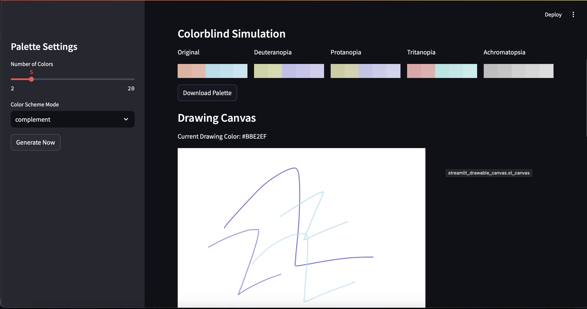

Welcome to Palettes! Check it out [here](https://palettes.streamlit.app).

Choose the number of colors you wish to generate and one of the eight color scheme mods! CHeck out their names and even save the pallete for later.

See how the pallete looks to colorblind peopke. Saw the "Use Color" buttons above? Use them on the canvas (and see how the distribution underneath it updates!).

Analyze the properties of the generated color palletes.

Finally, check out the palletes you have saved (and their analysis). Want to try them again on the canvas? Load them back up!

